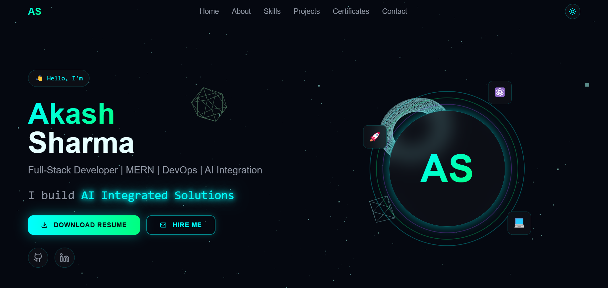

# Akash Sharma - 3D Portfolio Website

A premium, fully 3D, interactive portfolio website built with React, Three.js, and Framer Motion. Features futuristic design with glassmorphism, neon accents, and smooth animations.



## 🚀 Features

### Design
- **Futuristic 3D UI** with cyberpunk aesthetics
- **Dark/Light mode** with animated toggle
- **Glassmorphism** cards and components
- **Neon cyan & green** color palette
- **Particle background** with floating 3D geometry
- **Custom cursor** with magnetic effects
- **Smooth scroll** animations

### Sections
1. **Hero** - 3D animated intro with typing effect
2. **About** - Personal introduction with flip animation
3. **Skills** - Interactive skill cards with tooltips
4. **Projects** - Floating cards with expandable details
5. **Certificates** - 3D badge icons
6. **Education** - Layered timeline cards
7. **Contact** - Neon-styled form (sends to email)

### Interactions
- Scroll-triggered reveals
- Hover effects on all interactive elements
- Cursor-following parallax
- Card tilt animations
- Floating animations
- Glow pulse effects

## 🛠️ Tech Stack

- **Frontend**: React 18, TypeScript
- **3D Graphics**: Three.js, React Three Fiber, React Three Drei
- **Animations**: Framer Motion
- **Styling**: Tailwind CSS
- **UI Components**: shadcn/ui (customized)
- **Build Tool**: Vite
- **Email**: EmailJS (ready for integration)

## 📦 Installation

### Prerequisites
- Node.js 18+ 
- npm or yarn

### Steps

1. **Clone the repository**
   ```bash
   git clone https://github.com/akashsharma1462/akashsharma-portfolio.git
   cd akashsharma-portfolio
   ```

2. **Install dependencies**
   ```bash
   npm install
   ```

3. **Start development server**
   ```bash
   npm run dev
   ```

4. **Open in browser**
   ```
   http://localhost:8080
   ```

## 🏗️ Build for Production

```bash
npm run build
```

The built files will be in the `dist` folder.

## 📁 Project Structure

```
├── public/
│   ├── resume.pdf          # Your resume file
│   └── robots.txt
├── src/
│   ├── assets/             # Images and assets
│   ├── components/
│   │   ├── ui/             # shadcn/ui components
│   │   ├── AboutSection.tsx
│   │   ├── CertificatesSection.tsx
│   │   ├── ContactSection.tsx
│   │   ├── CustomCursor.tsx
│   │   ├── EducationSection.tsx
│   │   ├── Footer.tsx
│   │   ├── HeroSection.tsx
│   │   ├── Navbar.tsx
│   │   ├── ParticleBackground.tsx
│   │   ├── ProjectsSection.tsx
│   │   └── SkillsSection.tsx
│   ├── hooks/
│   ├── lib/
│   ├── pages/
│   │   ├── Index.tsx       # Main page
│   │   └── NotFound.tsx
│   ├── App.tsx
│   ├── App.css
│   ├── index.css           # Design system tokens
│   └── main.tsx
├── index.html
├── tailwind.config.ts      # Tailwind configuration
├── vite.config.ts
└── package.json
```

## ✏️ Customization Guide

### Personal Information
Edit these files to update your info:

1. **HeroSection.tsx** - Name, tagline, social links
2. **AboutSection.tsx** - Bio and highlights
3. **SkillsSection.tsx** - Your tech stack
4. **ProjectsSection.tsx** - Your projects
5. **CertificatesSection.tsx** - Certificates & achievements
6. **EducationSection.tsx** - Education history
7. **ContactSection.tsx** - Contact information
8. **Footer.tsx** - Copyright and social links

### Styling
- **Colors**: Edit `src/index.css` (CSS variables)
- **Fonts**: Change in `src/index.css` (Google Fonts import)
- **Animations**: Modify `tailwind.config.ts`

### Resume
Replace `public/resume.pdf` with your actual resume.

### Contact Form
To enable email functionality:

1. Sign up at [EmailJS](https://www.emailjs.com/)
2. Create an email template
3. Update `ContactSection.tsx` with your service details:
   ```typescript
   emailjs.send('YOUR_SERVICE_ID', 'YOUR_TEMPLATE_ID', formData, 'YOUR_PUBLIC_KEY')
   ```

## 🎨 Design System

### Colors (HSL)
```css
--primary: 180 100% 50%;      /* Neon Cyan */
--secondary: 150 100% 50%;    /* Neon Green */
--accent: 280 100% 60%;       /* Purple Glow */
--background: 220 20% 4%;     /* Deep Black */
--foreground: 180 100% 95%;   /* Light Text */
```

### Fonts
- **Display**: Orbitron (futuristic headings)
- **Body**: Rajdhani (readable content)
- **Mono**: Space Grotesk (code/tech text)

## 🚀 Deployment

### Lovable (Recommended)
1. Connect to Lovable
2. Click "Publish"
3. Your site is live!

### Vercel
```bash
npm install -g vercel
vercel
```

### Netlify
```bash
npm run build
# Drag dist folder to Netlify
```

## 📝 License

MIT License - feel free to use this template for your own portfolio!

## 🤝 Credits

- 3D graphics powered by [Three.js](https://threejs.org)
- Animations by [Framer Motion](https://www.framer.com/motion/)
- UI components from [shadcn/ui](https://ui.shadcn.com)

---

**⭐ If you found this helpful, please give it a star!**
